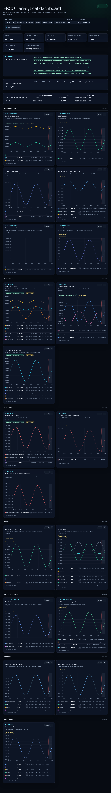
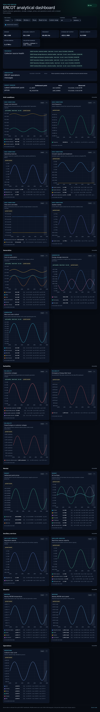
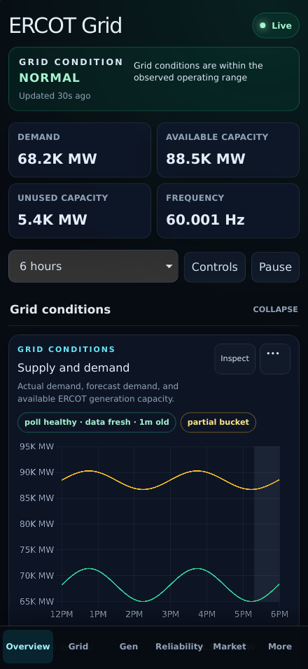
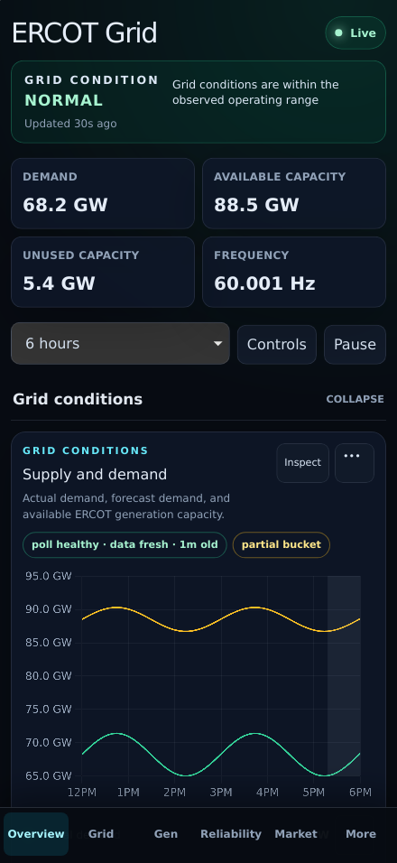

# PR 1: Human-friendly unit normalization

## Purpose

Make operational values readable without mental conversion while keeping every
API value and downloadable data point unchanged.

## Rationale

The baseline displayed ERCOT demand as `68.2K MW` and inertia as `1.2K GW·s`.
Those values are technically correct but slow a first-time reader. A single
formatter now applies domain-aware units, stable precision, natural price
placement, and thousands separators to overview cards, chart axes/tooltips,
legends, rankings, and accessible tables.

## Screenshots

| View    | Before                                                       | After                                                      |
| ------- | ------------------------------------------------------------ | ---------------------------------------------------------- |
| Desktop |  |  |
| Mobile  |    |    |

## UX notes

- Absolute values at or above 1,000 MW render as GW.
- Absolute values at or above 1,000 GW·s render as TW·s.
- Power uses one decimal, frequency three decimals, percentages one decimal,
  prices two decimals, and customer counts whole-number grouping.
- Price labels now use natural notation such as `-$42.16/MWh`.
- Compact `K` notation is removed; non-normalized values use grouping separators.

## Test coverage

- Unit tests cover both normalization thresholds, negative values, inertia,
  precision, grouping, currency placement, null, and NaN.
- The aggregate `npm test` command now runs frontend and receiver suites, making
  the directive's pre-commit gate executable without weakening existing tests.
- Deterministic Chromium and WebKit screenshots were reviewed and updated.

## Accessibility impact

Positive. Visible text and accessible chart tables use the same normalized,
fully spelled unit symbols; the change adds no color-only meaning, focus change,
or interactive control. Existing keyboard, screen-reader label, accessible data
table, and 44px mobile target coverage remains intact.

## Performance impact

Negligible. Formatting already used `Intl.NumberFormat`; the change adds one
constant-time unit-policy lookup and at most one division per rendered value.
It introduces no request, state, chart instance, or data-volume change. Existing
browser long-task/heap budgets remain green.

## Migration notes

None. This is display-only. Receiver schemas, collector payloads, stored values,
CSV exports, URLs, and API contracts are unchanged.

## CI reproducibility repair

The first fork-side CI run exposed an unrelated but directly blocking build
dependency: the collector imported its fixed-interval scheduler from a
third-party snippet URL that now returns 404. Cached `main` builds concealed the
failure; a clean PR build could not resolve it. The scheduler is now a small
local module with a direct deterministic test. Its immediate first iteration,
fixed cadence, skipped overdue intervals, and duty-cycle output are unchanged.
The dependency-cache layer copies the local scheduler alongside `deps.ts`, so
the image remains cache-efficient and independently buildable.
