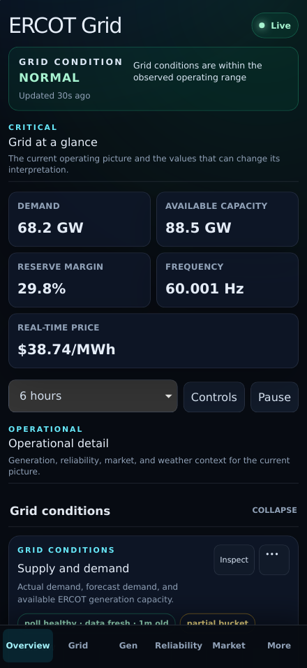

# PR 2: Information hierarchy

## Purpose

Make the dashboard answer the operating question before presenting the
engineering workspace. The interface now has explicit critical, operational,
and advanced layers backed by shared metadata rather than visual convention.

## Rationale

The previous overview mixed demand, storage, inertia, collector counts, and
capacity without a named grid status, reserve margin, or representative price.
All chart groups were also expanded on desktop, so internal timing and duty-cycle
signals competed with the current operating picture.

The critical surface now reads, in order: Grid status, Demand, Available
capacity, Reserve margin, Frequency, and Real-time price. Generation,
reliability, market, and weather form the operational layer. PRC, time error,
inertia, DC ties, ancillary detail, duty cycle, and full collector health remain
available in the advanced layer, which defaults collapsed on desktop and mobile.

## Screenshots

| View    | Before                                                       | After                                                      |
| ------- | ------------------------------------------------------------ | ---------------------------------------------------------- |
| Desktop |  |  |
| Mobile  |    |    |

## UX notes

- The current status and five supporting values occupy one scan surface.
- Houston Hub is the representative real-time price; detailed settlement-point
  rankings and charts remain unchanged.
- Reserve margin is `(available capacity - demand) / demand × 100`; it renders
  unavailable when demand or capacity is missing or demand is nonpositive.
- Every chart group has a typed level, description, stable order, and collapse
  default. No chart or series was deleted.
- Full collector health moved below advanced analysis; PR 3 will turn it into a
  dedicated on-demand diagnostics experience.

## Test coverage

- Unit tests enforce the exact six-metric critical order, complete group
  assignment, advanced engineering inventory, collapse defaults, and reserve
  margin availability rules.
- E2E checks assert hierarchy headings, advanced discoverability, reduced
  initial chart DOM, operational navigation, and all existing interactions.
- Deterministic local Chromium and iPhone WebKit screenshots were regenerated
  and visually reviewed.
- A deterministic manual-dispatch mode runs the same CI matrix for stacked PRs
  whose base is not `main`; live-source verification remains a separate explicit
  dispatch choice and never runs as part of that deterministic gate.
- Paired desktop visual assertions report both divergences in one artifact while
  retaining a failing job conclusion, matching the mobile VRI evidence flow.

## Accessibility impact

Positive. Each layer is a labelled section with a real heading; status remains
textual rather than color-only. Existing keyboard group toggles, focus transfer,
inspect dialogs, accessible chart tables, and 44px mobile targets are preserved.
Advanced data remains reachable through ordinary buttons with accurate
`aria-expanded` state.

## Performance impact

Positive. Seven advanced charts no longer enter the desktop DOM until requested,
reducing the initial chart-card count from 19 to 12 and preserving lazy chart
construction. No additional series request is made for collapsed groups. The
critical price uses the existing batched latest endpoint.

## Migration notes

None. API schemas, receiver storage, collector payloads, URLs, chart IDs, CSV
exports, and raw metric values are unchanged. The group label of advanced chart
definitions changes only frontend presentation order.
