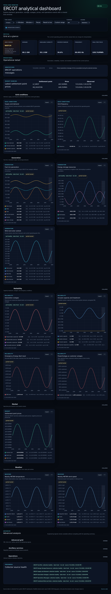
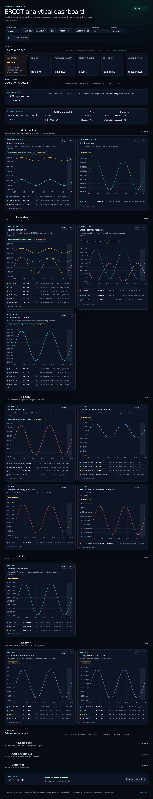

# PR 3: Diagnostics separation

## Purpose

Keep source collection internals out of the operating overview when the data
pipeline is healthy, without concealing failures or removing any diagnostic
detail.

## Rationale

The previous desktop footer printed collection state, freshness, observation
age, source timestamp, and the last error for every collector. That information
is useful during diagnosis but competes with the grid picture during normal
operation. The overview now shows one System health summary. Its healthy
default is **Data Sources Healthy**; degraded sources produce an explicit
attention count and identify the highest-priority problem. The complete,
severity-sorted source inventory remains available from **Review diagnostics**.

## Screenshots

| View    | Before                                                       | After                                                      |
| ------- | ------------------------------------------------------------ | ---------------------------------------------------------- |
| Desktop |  |  |
| Mobile  |    |    |

## UX notes

- Healthy, attention, and unavailable states are distinct. An absent report is
  never described as healthy.
- Failed, stale, and delayed sources contribute to the attention count;
  failures sort ahead of stale and delayed sources in the detail view.
- The compact summary omits long upstream errors. The on-demand dialog retains
  collection state, freshness, age, source timestamp, and the complete error.
- Desktop and mobile use the same typed summary policy and the same diagnostics
  dialog.

## Test coverage

- Unit tests cover healthy, attention, source priority, counts, and missing
  health reports.
- Desktop E2E verifies the default summary, hidden-by-default source details,
  degraded state, dialog content, Escape close, and focus restoration.
- Mobile E2E verifies compact long-error handling, complete detail disclosure,
  horizontal containment, and focused WebKit visual states.
- Deterministic desktop and mobile before/after screenshots were regenerated
  and visually reviewed.

## Accessibility impact

Positive. State is written in text and does not depend on border color. The
summary update is announced politely, the trigger declares a dialog, the dialog
has a labelled title and description, Escape closes it, and focus returns to
the originating trigger. Existing 44px mobile targets are preserved.

## Performance impact

Neutral to positive. The source-health request and payload are unchanged. The
default desktop DOM replaces one chip per source with a single summary; source
articles are rendered only while the dialog is open.

## Migration notes

None. Source-health API fields, polling, storage, alert semantics, chart source
badges, and URLs are unchanged. This PR changes only presentation and adds a
pure summary policy.
