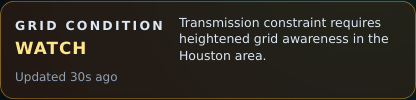
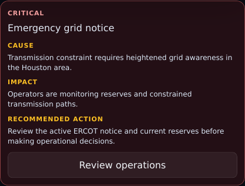

# PR 4: Alert rationalization

## Purpose

Reserve the operating overview for alerts that change grid interpretation,
materially limit critical data, or give the user a concrete recovery action.

## Rationale

The previous overview could turn the grid status into `DATA ISSUE` for any
collector failure, including an isolated storage feed, and request failures
printed raw internal error text. Healthy source polling chips also appeared on
every chart. That made internal collection state look like grid risk.

The new policy admits only active warning/watch/emergency notices, stale or
failed sources that support critical demand/capacity/frequency/EEA/operations
interpretation, and retryable dashboard request failures. The highest-severity
active notice occupies the overview; complete notice history remains one action
away. Each public alert has severity, cause, impact, and recommended action.

## Screenshots

| View    | Before                                                       | After                                                      |
| ------- | ------------------------------------------------------------ | ---------------------------------------------------------- |
| Desktop |  |  |
| Mobile  |    |    |

## UX notes

- A noncritical collector failure remains visible in System health and on an
  affected stale chart, but no longer changes the top-level Grid condition.
- Healthy chart-level polling chips are removed. Degraded chart badges describe
  user-facing data freshness without exposing collection-loop state.
- Raw request and collector errors do not appear on general surfaces. Full
  collector errors remain available in the on-demand diagnostics dialog.
- Request failures preserve prior observations, distinguish failure from an
  empty window, and provide an explicit **Retry data** action.
- When multiple active operational notices exist, the highest severity is
  summarized; **Review operations** preserves access to the full history.

## Test coverage

- Unit tests cover active and closed notices, emergency priority, noncritical
  collector suppression, material critical-source failures, and public request
  failure language.
- Desktop E2E checks the four alert fields, operation drill-down, noncritical
  source suppression, error redaction, degraded chart state, and focused alert
  visuals.
- Mobile E2E checks normal grid status during isolated collector failure,
  structured emergency presentation, retry action, redaction, no overflow, and
  Chromium/WebKit responsive behavior.

## Accessibility impact

Positive. Severity is text, not color alone; cause, impact, and action use
semantic headings/definition terms; the active-alert region is announced; and
every alert has a keyboard-operable action. Existing focus traps, restoration,
visible focus, and 44px mobile targets remain covered.

## Performance impact

Neutral. Alert derivation is a small memoized pure function over already-loaded
events and source health. It adds no network request. Removing healthy status
chips reduces repeated default chart content.

## Migration notes

None. APIs, collection, alert payloads, storage, URLs, event history, and
diagnostic detail are unchanged. The material-source allowlist and public alert
copy are frontend policy.
