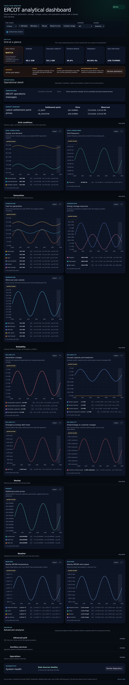
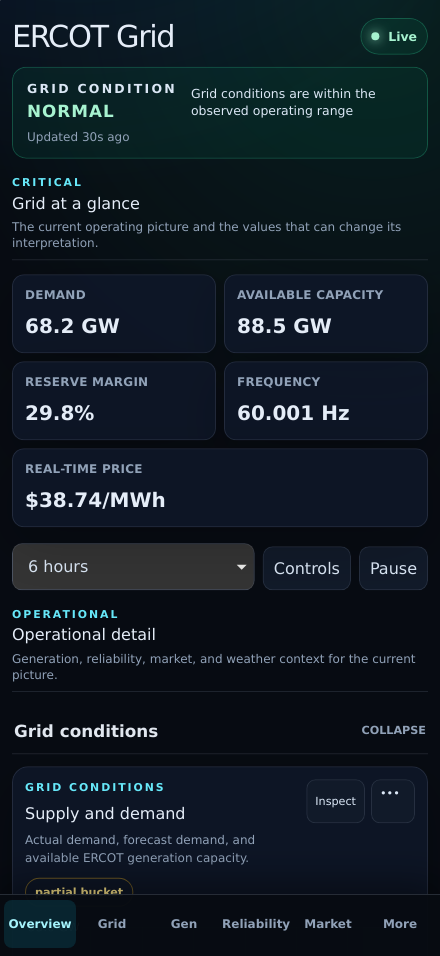
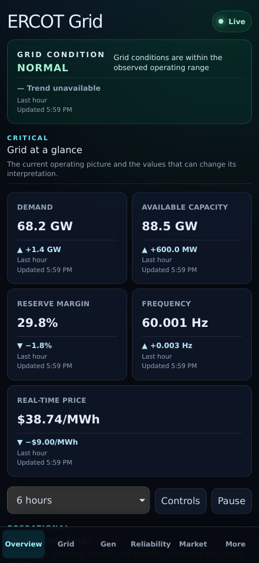

# PR 5: hero trend redesign

## Purpose

Make every top metric answer not only “what is it now?” but also “which way did
it move over the last hour?” without manufacturing history the API does not
provide.

## Rationale

The previous hero cards displayed current values only. This change loads a
bounded one-hour baseline for demand, available capacity, frequency, and the
Houston real-time price, then compares that earliest valid sample with the
latest observation. Reserve-margin movement is derived from the demand and
capacity baselines. Grid status states that its hourly trend is unavailable
because no historical status series exists.

## Screenshots

| View    | Before                                                       | After                                                      |
| ------- | ------------------------------------------------------------ | ---------------------------------------------------------- |
| Desktop |  |  |
| Mobile  |    |    |

## UX notes

- Every hero card contains a primary value, arrow, signed delta, “Last hour”
  comparison label, and observation timestamp.
- Increasing and decreasing are neutral informational states; an increase is
  not assumed to be good or bad.
- Steady and unavailable comparisons use explicit text, not color alone.
- Mobile fixtures demonstrate rising demand, capacity, and frequency plus
  falling reserve margin and price in the first viewport.

## Test coverage

- Pure unit tests cover rising, falling, steady, missing, and non-finite inputs
  through the centralized unit formatter.
- Desktop E2E verifies all six trend regions, timestamps, direction labels, and
  empty-history behavior.
- Mobile E2E verifies that all trend regions remain visible, accessible, and
  free of horizontal overflow.
- The complete Chromium, mobile Chromium, iPhone WebKit, compact portrait, and
  landscape suite is regenerated for the revised card geometry.

## Accessibility impact

Positive. Each trend is an explicitly labeled group whose accessible name says
increasing, decreasing, unchanged, or unavailable. Arrows and signed text make
direction independent of color, and timestamps use semantic `time` elements.

## Performance impact

One batched request adds four bounded, at-most-120-point series during overview
loading. No additional chart instances or persistent timers are introduced;
advanced chart lazy-loading and the existing browser budgets remain intact.

## Migration notes

None. Existing latest and series APIs are reused, URLs are unchanged, and no
collector, receiver schema, or storage migration is required.
