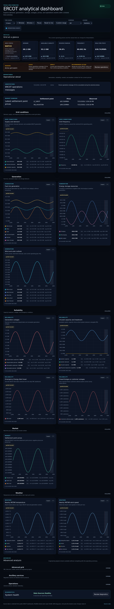
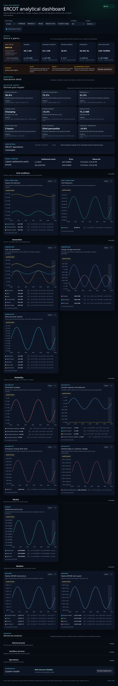
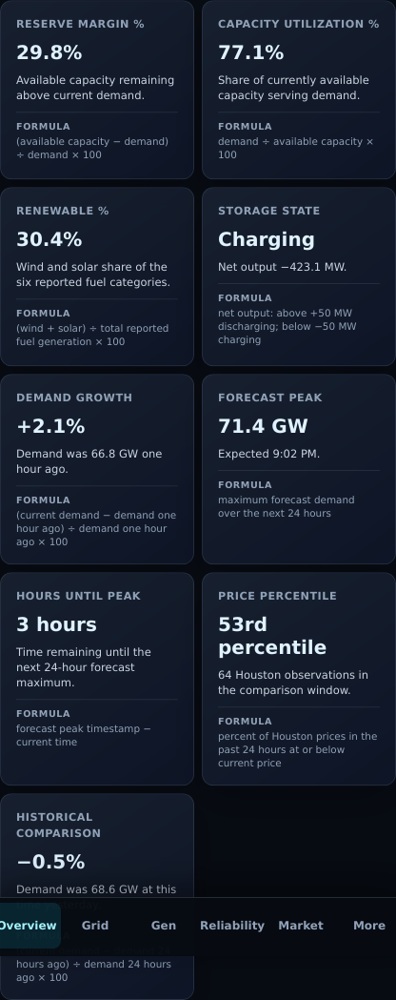

# PR 6: derived grid metrics

## Purpose

Turn existing ERCOT observations into nine plainly labeled operational insights
without implying confidence when a required reading or comparison window is
missing.

## Rationale

Raw demand, capacity, fuel, storage, forecast, and price series answer narrow
questions. The derived section makes their relationships scannable while
keeping every calculation visible and freshness-gated. It uses only existing
receiver APIs and metrics; no collector, schema, or storage change is required.

## Screenshots

| View    | Before                                                       | After                                                      |
| ------- | ------------------------------------------------------------ | ---------------------------------------------------------- |
| Desktop |  |  |
| Mobile  |    |    |

## Metric definitions

| Metric                 | Formula or rule                                                            |
| ---------------------- | -------------------------------------------------------------------------- |
| Reserve Margin %       | `(available capacity - demand) / demand * 100`                             |
| Capacity Utilization % | `demand / available capacity * 100`                                        |
| Renewable %            | `(wind + solar) / total of all six reported fuel categories * 100`         |
| Storage State          | Discharging above +50 MW, charging below -50 MW, otherwise idle            |
| Demand Growth          | `(current demand - demand one hour ago) / demand one hour ago * 100`       |
| Forecast Peak          | Maximum forecast demand in the next 24 hours                               |
| Hours Until Peak       | `(forecast peak timestamp - current time) / 3600`                          |
| Price Percentile       | Share of past-24-hour Houston prices at or below the current Houston price |
| Historical Comparison  | `(current demand - demand 24 hours ago) / demand 24 hours ago * 100`       |

Latest observations must be no more than 30 minutes old. One-hour and prior-day
comparisons must be within one hour of their target timestamp. Forecast samples
must fall between now and 24 hours from now. Missing, stale, non-finite, zero-
denominator, and out-of-window inputs produce an em dash and an explicit
unavailable explanation.

## UX notes

- The section follows the operational introduction and uses a three-column
  desktop and two-column mobile grid.
- Every card exposes its formula, primary value, and interpretation detail.
- Signed changes are formatted by the shared unit utility; components do not
  assemble their own signs, currency, precision, or scaled units.
- Unavailable results remain in place so absence is distinguishable from a
  layout or loading failure.

## Test coverage

- Pure tests cover all nine normal results, query inventory, storage deadband,
  stale inputs, missing fuel data, missing history, and distant comparisons.
- Desktop E2E verifies the nine-card inventory, formulas, populated results,
  and graceful failure of the entire derived-history request.
- Mobile Chromium and WebKit coverage verifies accessible names, populated
  state, and zero horizontal overflow.
- Full-page desktop and feature-level mobile visual regression baselines cover
  hierarchy, density, wrapping, and spacing.

## Accessibility impact

Positive. The metric collection has a named region, each card is a semantic
article, and each accessible name includes the label, current value,
interpretation, and formula. Missing results use text and an em dash rather than
color alone. Values and formulas wrap at narrow widths without clipping.

## Performance impact

The existing latest batch gains seven observations. One additional series batch
loads three bounded contexts: at most 288 forecast points, 288 price points, and
60 prior-day demand points. No new chart instances, intervals, persistent
listeners, or unbounded histories are introduced.

## Migration notes

None. Existing latest and series endpoints are reused, and URL state, receiver
schema, collector behavior, and stored observations are unchanged.
