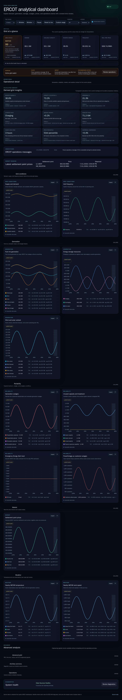

# PR 7: Grid Health Score

## Purpose

Answer “Is the Texas grid healthy?” with one bounded, explainable score while
preserving the source readings and operational alerts that qualify that answer.

## Rationale

The dashboard already exposes the readings needed to assess grid conditions,
but interpreting them requires scanning several cards and charts. The Grid
Health Score combines eight distinct signals into a 0–100 summary. Its factor
breakdown remains one disclosure away, so operators can see every input,
penalty, missing source, and override rather than trusting a black box.

## Screenshots

| View    | Before                                                       | After                                                      |
| ------- | ------------------------------------------------------------ | ---------------------------------------------------------- |
| Desktop |  |  |
| Mobile  |    |    |

## Scoring algorithm

Each available factor starts with its maximum weight. A piecewise-linear
penalty is subtracted at the thresholds below. The final score normalizes the
retained points over the available weight and rounds to an integer:

`round(100 × (1 - available factor penalties / available factor weight))`

| Factor               | Weight | No-penalty range                  | Penalty thresholds                             |
| -------------------- | -----: | --------------------------------- | ---------------------------------------------- |
| Reserve margin       |     25 | 15% or higher                     | 10%: 10; 5%: 20; 0% or lower: 25               |
| Frequency            |     15 | within 0.02 Hz of 60 Hz           | 0.05 Hz: 5; 0.10 Hz: 10; 0.20 Hz: 15           |
| EEA level            |     15 | Level 0                           | Levels 1, 2, and 3: 5, 10, and 15              |
| Generation outages   |     10 | 5% or less of available capacity  | 8%: 4; 12%: 8; 20%: 10                         |
| Houston price        |     10 | $0–$100/MWh                       | Positive $500: 3; $1,000: 6; $5,000: 10        |
|                      |        |                                   | Negative -$50: 2; -$250: 6; -$1,000: 10        |
| Weather stress       |      5 | 0–35°C across current stations    | Heat 40°C: 3; 45°C: 5; cold -10°C: 3; -20°C: 5 |
| Capacity utilization |     10 | 80% or lower                      | 90%: 5; 100%: 10                               |
| Forecast pressure    |     10 | next-24-hour peak at 85% or lower | 95%: 5; 100%: 10                               |

Values between thresholds are interpolated. Each penalty is clamped from zero
to that factor’s weight, so the normalized result remains between 0 and 100.

## Status and data-confidence rules

| Score  | Status   |
| ------ | -------- |
| 85–100 | NORMAL   |
| 70–84  | WATCH    |
| 50–69  | STRAINED |
| 0–49   | CRITICAL |

Fresh demand, available capacity, and frequency are mandatory core readings.
At least 70% of weighted factors must be available. Latest grid and market
readings may be no more than 30 minutes old, METAR readings no more than two
hours old, and forecast samples must fall between now and 24 hours from now.
If core data or minimum coverage is missing, the numeric score is unavailable.
If any optional factor is missing but the remaining score would be NORMAL, the
status is `LIMITED DATA` rather than NORMAL.

An active public operational alert remains the visible grid-condition label
because an explicit ERCOT event takes precedence over an inferred score. EEA
levels also set a minimum severity: levels 1, 2, and 3 override the calculated
label to WATCH, STRAINED, and CRITICAL. The numeric score and its breakdown stay
visible in both cases.

## UX notes

- Desktop and mobile grid-status surfaces show the score, denominator, and
  weighted coverage alongside the condition label.
- A native disclosure explains the formula and lists all eight factors with
  their maximum and retained points.
- Missing factors remain in the list with an explicit unavailable reason.
- The existing hourly trend remains unavailable for grid status because the
  receiver does not collect score history; the UI does not fabricate one.

## Test coverage

- Pure tests cover the query inventory, all-factor healthy state, bounded
  stressed state, EEA override, optional-factor loss, stale mandatory data, and
  the eight weights summing to 100.
- Desktop E2E verifies the score, coverage, factor inventory, thresholds,
  limited-data state, and unavailable-core state.
- Mobile WebKit verifies the score is present in the operational summary before
  controls and charts.
- Dedicated desktop and mobile visual baselines cover the expanded explanation,
  responsive factor layout, and current score presentation.

## Accessibility impact

Positive. The numeric score is a named group that announces its value and
coverage. The explanation uses a keyboard-operable native `details` control,
the eight factors are a named semantic list, and unavailable state is expressed
with text rather than color alone. The disclosure summary maintains the 44-pixel
mobile target contract.

## Performance impact

The existing latest batch gains six bounded observations: EEA, total generation
outages, and four METAR temperatures. Forecast pressure reuses PR 6’s bounded
next-24-hour forecast context. Scoring is a pure in-memory calculation over six
latest values, four temperatures, and the already loaded forecast window. No
new interval, chart, listener, storage query shape, or unbounded history is
introduced.

## Migration notes

None. Existing latest and series endpoints are reused, and receiver schema,
collector behavior, stored observations, and URL state are unchanged.
