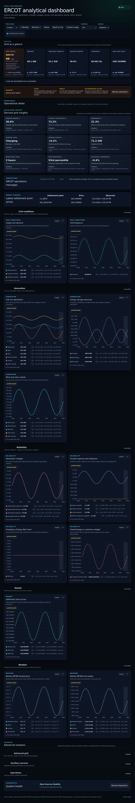
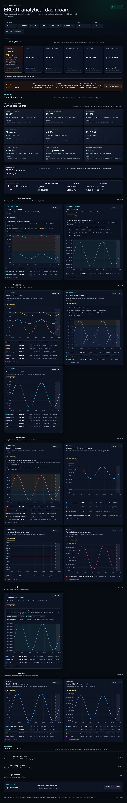
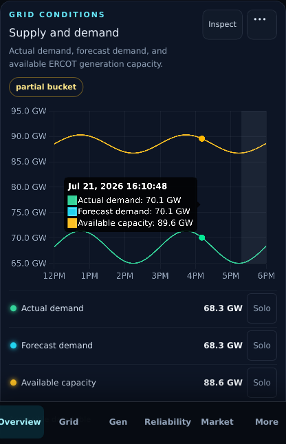
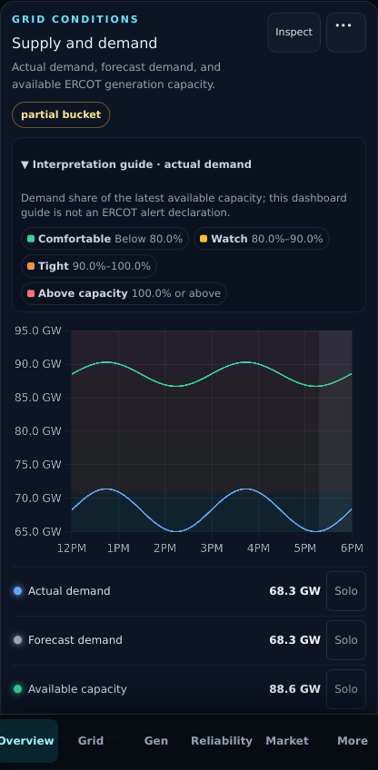

# PR 8: chart interpretation

## Purpose

Make the dashboard’s main trend charts explain what their vertical position
means, using restrained semantic threshold bands and a complete text equivalent
instead of decorative line colors alone.

## Rationale

The charts previously identified series but left interpretation to the reader.
That was especially costly for frequency, capacity utilization, reserves,
storage direction, outage magnitude, and volatile prices. PR 8 adds one typed
interpretation policy to each applicable chart. The same metadata draws the
canvas background, renders its visible key, and generates the canvas accessible
name, preventing the visual and non-color explanations from drifting.

These are dashboard interpretation guides. They do not claim to reproduce
ERCOT emergency declarations, Energy Emergency Alert thresholds, or market
intervention rules. Operational alerts and source readings remain authoritative.

## Screenshots

| View    | Before                                                       | After                                                      |
| ------- | ------------------------------------------------------------ | ---------------------------------------------------------- |
| Desktop |  |  |
| Mobile  |    |    |

## Interpretation policies

| Chart subject                  | Bands                                                                                                                  | Basis                                                    |
| ------------------------------ | ---------------------------------------------------------------------------------------------------------------------- | -------------------------------------------------------- |
| Actual demand                  | below 80% comfortable; 80–90% watch; 90–100% tight; 100%+ above capacity                                               | Share of latest available capacity                       |
| Frequency                      | below 59.8 critical; 59.8–59.9 strained; 59.9–59.95 watch; 59.95–60.05 near nominal; mirrored high-side bands to 60.2+ | Distance from nominal 60 Hz                              |
| Physical responsive capability | below 2.5 GW very low; 2.5–3 GW tight; 3–4 GW watch; 4 GW+ higher                                                      | PRC series only; dashboard heuristic, not EEA thresholds |
| Net storage output             | below -50 MW charging; -50–50 MW near idle; 50 MW+ discharging                                                         | Published sign convention and existing storage deadband  |
| Total generation outages       | below 5% lower; 5–8% elevated; 8–12% high; 12%+ very high                                                              | Share of latest available capacity                       |
| Settlement point prices        | below $0 negative; $0–$100 lower; $100–$1,000 elevated; $1,000+ very high                                              | Same contextual guide for each displayed hub             |

Relative policies draw only after a positive, finite reference observation is
available. Until then the key remains readable and explicitly says that the
canvas bands are waiting for the reference; no threshold is fabricated.

Total generation outages is added to the outage chart because the percentage
policy describes the total, not any one planned or unplanned component. The
component lines remain available. Planned and unplanned categories now use
semantic amber and orange, while solid and dashed strokes distinguish
dispatchable from renewable observations without depending on hue alone.

## UX notes

- Low-opacity bands render behind the existing lines, event overlays, cursor,
  and partial-bucket marker.
- Desktop keys start expanded for immediate interpretation. Mobile keys start
  collapsed to protect scan density and expand with a native disclosure.
- Demand, capacity, frequency, reserve, storage, outage, and price lines use
  semantic or neutral colors; severity belongs to the bands rather than a
  categorical series color.
- Relative values reuse the already loaded series map. No extra request or
  refresh path is introduced.

## Test coverage

- Pure policy tests require every directive chart to have contiguous,
  open-ended bands and a valid subject series.
- Resolution tests cover the latest finite reference, exact ratio conversion,
  and missing or nonpositive reference behavior.
- Text-equivalence tests cover full frequency ranges in the canvas accessible
  description.
- Desktop E2E verifies resolved demand bands and the seven frequency bands.
- Mobile WebKit verifies the collapsed disclosure, expanded text key, canvas
  accessible name, and zero horizontal overflow.
- Desktop and mobile visual baselines cover the band rendering, key density,
  line colors, and responsive disclosure.

## Accessibility impact

Positive. Semantic color is redundant with a visible label and numeric range.
The canvas accessible name contains the subject, basis, and every band. Native
details/summary controls are keyboard operable, and the mobile summary keeps a
44-pixel target. Outage category strokes add a solid/dashed distinction in
addition to labels and color.

## Performance impact

Each interpreted chart draws three to seven clipped rectangles during its
existing Chart.js draw cycle. Relative-band resolution scans backward only
until it finds the latest finite reference. No chart instance, interval,
listener, endpoint, unbounded history, or persistent state is added. The outage
chart gains one existing receiver metric series for total outages.

## Migration notes

None. The receiver schema, collector behavior, stored observations, API shapes,
URL state, and deployment configuration are unchanged.
