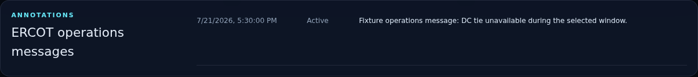
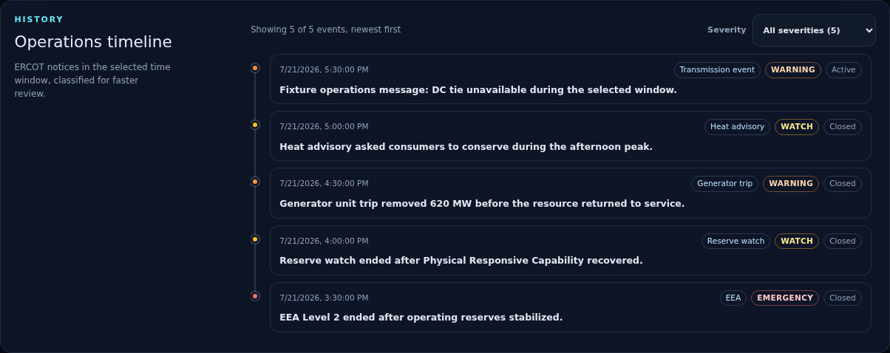
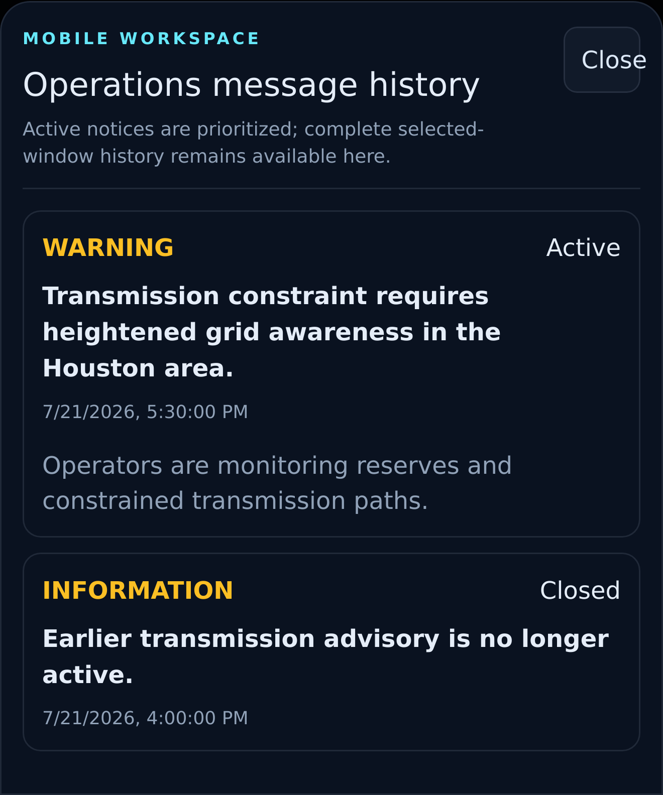
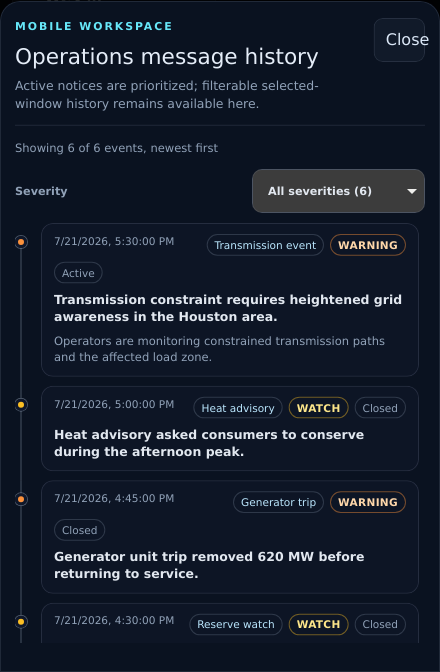

# PR 9: operations timeline

## Purpose

Replace the sparse operations-message list and repeated no-message copy with a
historical, severity-filterable timeline that makes ERCOT notices faster to
scan without changing the stored event record.

## Screenshots

| View    | Before                                                       | After                                                      |
| ------- | ------------------------------------------------------------ | ---------------------------------------------------------- |
| Desktop |  |  |
| Mobile  |    |    |

## Timeline policy

The receiver already persists deduplicated operations events and returns them
newest first for the selected dashboard window. PR 9 preserves that source of
truth and adds a pure presentation policy:

- Emergency Energy Alert and `EEA` text is labeled **EEA**.
- Generator or generating-unit loss/trip text is labeled **Generator trip**.
- Heat, temperature, weather-advisory, or conservation-appeal text is labeled
  **Heat advisory**.
- Reserve, Physical Responsive Capability, or PRC text is labeled **Reserve
  watch**.
- Transmission, constraint, DC-tie, line, or transformer text is labeled
  **Transmission event**.
- Unmatched records remain visible as **Operational notice**; nothing is
  silently discarded.

These categories are dashboard reading aids derived from the event type, title,
and body. They are not new ERCOT declarations and are not written back to the
receiver. The source status remains visible alongside the category.

Severity is normalized into Emergency, Warning, Watch, and Information for a
single-select filter. Explicit source severity takes precedence except when the
notice text is more specific, such as an EEA level or reserve watch. Each level
has a visible text label; marker color is redundant.

## UX behavior

- Events are sorted newest first on both desktop and mobile, independently of
  API ordering.
- The filter reports visible and total counts, and each option includes its
  event count.
- Every record shows timestamp, category, normalized severity, source status,
  title, and a distinct body when present.
- A connected vertical rail preserves chronology without turning the list into
  a dense table.
- The desktop panel scrolls at a bounded height. Mobile uses the existing
  focus-trapped drawer and keeps the filter target at least 44 pixels high.
- A selected severity with no matching events gets a specific recovery path;
  a window with no history recommends choosing a longer range.

## Test coverage

- Pure tests cover all five requested categories, the truthful fallback,
  severity normalization, immutable newest-first ordering, and filtering.
- Desktop Chromium verifies five-category rendering, severity counts, the
  watch filter, and the complete timeline visual.
- Mobile Chromium and WebKit verify full history remains behind the active
  summary, Emergency filtering, and zero horizontal overflow.
- Mobile visual regression covers the populated timeline drawer.

## Accessibility impact

Positive. The history is an ordered list with real timestamps, visible category
and severity labels, a named native select, a polite count announcement, and
text-based empty states. The mobile filter meets the existing 44-pixel target
contract, and the drawer retains focus trapping, Escape close, and trigger
focus restoration.

## Performance impact

The feature sorts and classifies at most the existing 500-event API limit in a
memoized pure transform. Filtering is local. It adds no request, endpoint,
database migration, listener, timer, chart instance, or persistent state.

## Migration notes

None. Existing operations events, dedupe keys, API fields, selected-window
semantics, chart annotations, alert rationalization, and collector behavior are
unchanged.
