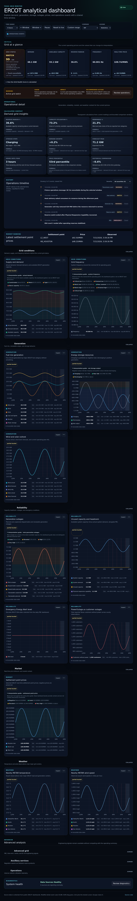
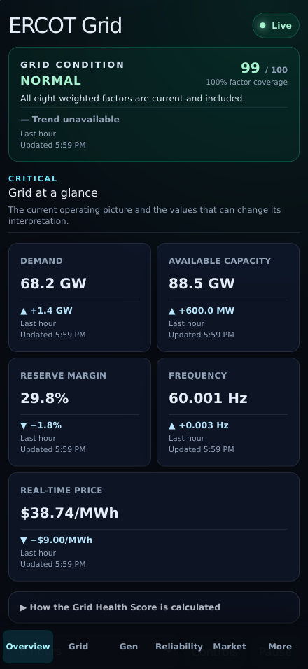
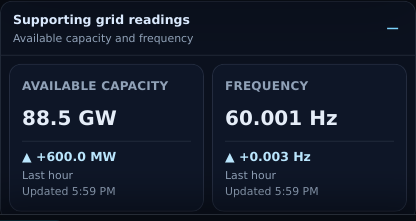

# PR 10: mobile optimization

## Purpose

Make the operating picture faster to scan on a phone by prioritizing Grid
Status, Demand, Reserve Margin, and Real-time Price while preserving supporting
capacity and frequency readings one deliberate tap deeper.

## Screenshots

| View    | Before                                                       | After                                                      |
| ------- | ------------------------------------------------------------ | ---------------------------------------------------------- |
| Desktop |  |  |
| Mobile  |    |    |

The expanded supporting state is also captured in
.

## Mobile priority policy

The critical layer now has an explicit, tested mobile partition:

- **Primary:** Grid Status, Demand, Reserve Margin, and Real-time Price.
- **Supporting:** Available Capacity and Frequency.

Grid Status remains the dedicated condition surface. The other three primary
metrics form a compact two-row card grid. Available Capacity and Frequency are
not removed or summarized away: their current value, one-hour direction,
delta, comparison window, and observation time remain in a collapsed
**Supporting grid readings** disclosure.

The policy is expressed as typed metric identifiers in the information
architecture module. A unit test verifies that the two tiers are disjoint and
still contain all six critical metrics, preventing future omissions.

## UX behavior

- The four primary surfaces fit in the initial 440 x 956 WebKit viewport.
- The supporting disclosure starts collapsed and names both readings before it
  is opened.
- The disclosure summary is a native keyboard-operable control with a measured
  48-pixel minimum height.
- Expanded supporting cards retain the same formatting and trend semantics as
  desktop cards without horizontal scrolling.
- Grid Health methodology stays collapsed, and all non-Grid chart groups keep
  the existing collapsed mobile defaults.
- Existing quick controls, safe-area navigation, chart vertical-pan policy,
  and deliberate inspect gestures are unchanged.
- Desktop retains the complete six-card critical overview and is visually
  unchanged.

## Test coverage

- Pure architecture coverage asserts the ordered four/two partition,
  uniqueness, and complete retention of the six critical metrics.
- Mobile Chromium and WebKit verify the three primary overview cards plus the
  dedicated Grid Status surface, collapsed supporting state, expansion,
  retained trend labels, first-viewport placement, and no horizontal overflow.
- The 44-point contract measures the new supporting summary alongside controls,
  chart actions, legends, data disclosures, and navigation.
- Visual regression covers both the initial phone viewport and the expanded
  supporting-reading state. The desktop full-page baseline remains unchanged.
- Compact portrait, increased text, and landscape projects continue to cover
  responsive behavior.

## Accessibility impact

Positive. The initial reading order now matches operational priority, and the
secondary readings remain available through native `details`/`summary`
semantics. Metric names, values, trend direction, comparison window, and exact
update context remain text-accessible. Color is not required to identify any
reading. Keyboard operation, focus indication, zoom, reduced motion, safe-area
layout, and the existing 44-pixel mobile target contract are retained.

## Performance impact

No new request, listener, timer, chart instance, or persistent state is added.
The six-item overview array is partitioned during the existing render. The
supporting cards use the same lightweight text components and remain hidden by
native disclosure until requested. Existing mobile chart-mount, heap-growth,
long-task, production-build, and receiver benchmark gates remain authoritative.

## Migration notes

None. API contracts, stored observations, metric units, Grid Health scoring,
alerts, URL state, collector behavior, and desktop information architecture are
unchanged. The shared Deno dependency cache is locked during multi-architecture
collector image builds so parallel platforms cannot race while the cache is
copied into the image; this changes build synchronization, not the collector
runtime or its dependencies. Physical iPhone Safari review remains an
external-device acceptance step; automated evidence uses the documented 440 x
956 WebKit project and does not claim physical-device validation.
