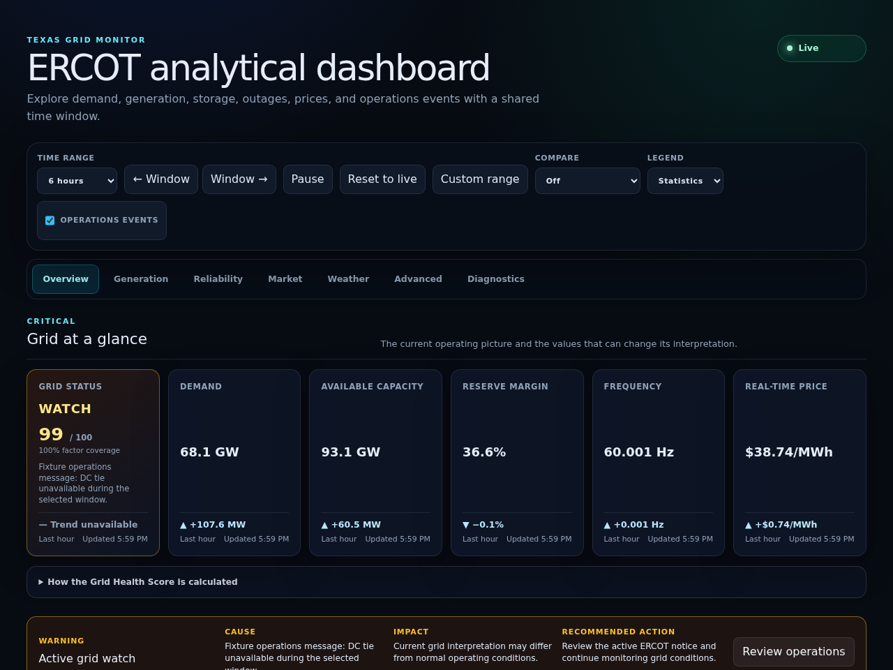
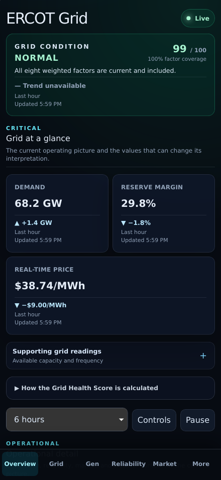
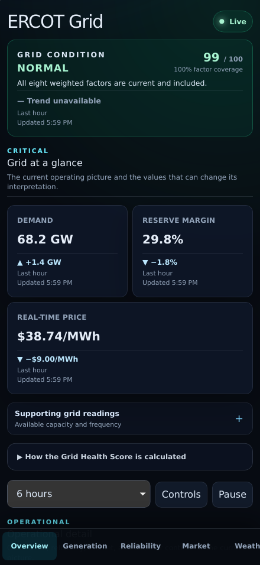
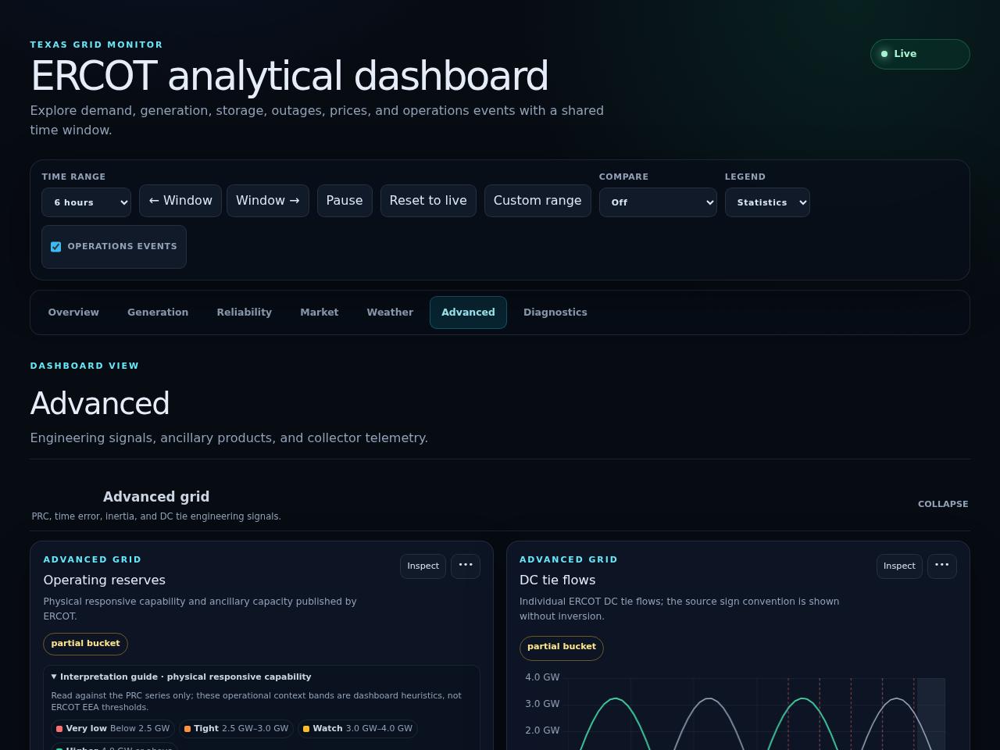
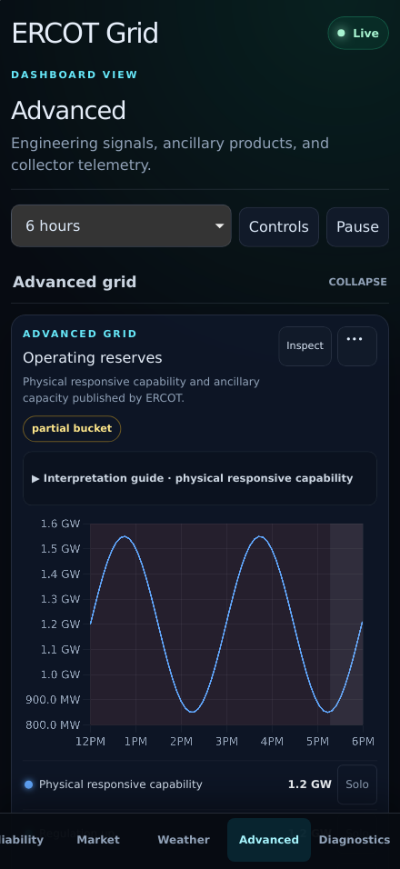
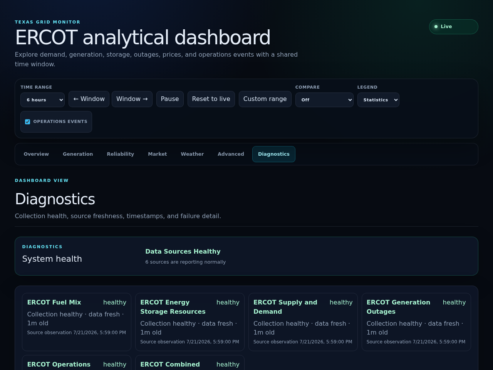
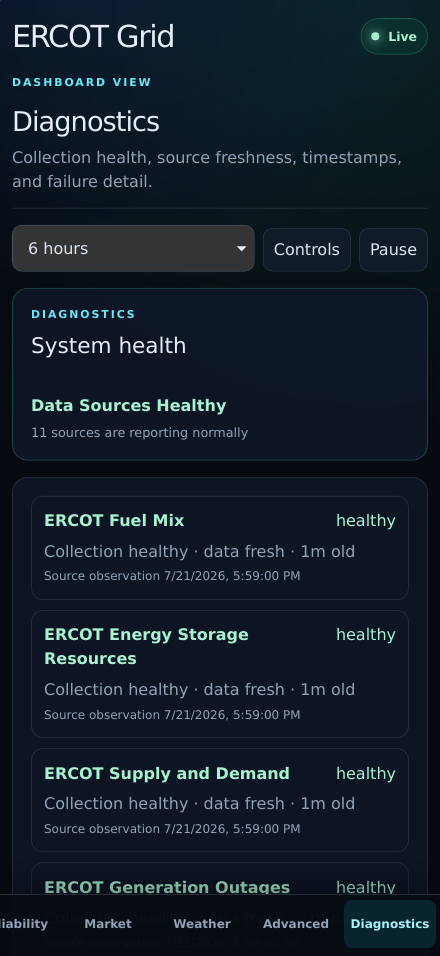

# PR 11: progressive disclosure

## Purpose

Replace the single long dashboard and scroll-to-section shortcuts with seven
explicit, URL-addressable views: Overview, Generation, Reliability, Market,
Weather, Advanced, and Diagnostics. Engineering information moves deeper in
the hierarchy without being removed.

## Screenshots

| View    | Before                                                       | After                                                      |
| ------- | ------------------------------------------------------------ | ---------------------------------------------------------- |
| Desktop |  |  |
| Mobile  |    |    |

The deeper layers are captured separately:

| Layer       | Desktop                                                                | Mobile                                                               |
| ----------- | ---------------------------------------------------------------------- | -------------------------------------------------------------------- |
| Advanced    |        |        |
| Diagnostics |  |  |

## View ownership

| View        | Owned information                                                                     |
| ----------- | ------------------------------------------------------------------------------------- |
| Overview    | Grid condition, six critical readings, alerts, derived insights, Grid conditions      |
| Generation  | Fuel mix, renewable generation, and storage                                           |
| Reliability | Operations timeline, capacity headroom, outages, and emergency conditions             |
| Market      | Settlement-point ranking and real-time market charts                                  |
| Weather     | Temperature and wind observations                                                     |
| Advanced    | Advanced grid signals, ancillary services, and collector utilization                  |
| Diagnostics | Source collection state, data freshness, source timestamps, and complete error detail |

The mapping is a typed, exhaustively tested information-architecture policy.
Every configured chart group belongs to exactly one view, and duplicate or
unassigned groups fail unit coverage.

## URL and navigation behavior

- `view=<id>` is normalized on startup and retained beside the existing time,
  comparison, event, legend, inspect, and hidden-series parameters.
- A view selection adds a browser-history entry. Back and forward navigation
  restore both the URL and rendered view without a reload.
- Invalid or absent view values safely resolve to Overview. Older chart-inspect
  links without `view` infer the inspected chart's owning view.
- Desktop exposes all seven options in a compact navigation strip. Mobile uses
  a safe-area fixed, horizontally scrollable strip with 48-pixel targets.
- The selected option uses `aria-current="page"`; view changes move focus to
  the new view heading and keep a visible focus indicator.
- Non-Overview mobile views retain the shared time range, Controls, and Pause
  actions directly below the view heading.

## Progressive disclosure and data retention

Overview remains the five-second operating surface. It retains the four
mobile-primary readings and the supporting capacity/frequency disclosure from
PR 10. The other views render only their owned information, reducing page
length and concurrent chart work. Visiting a view opens its owned chart groups;
leaving it unmounts those surfaces and excludes them from subsequent series
requests.

Reliability now owns the full selected-window operations timeline. Market owns
the complete settlement ranking. Diagnostics presents the concise health
summary followed by every source's collection state, freshness state, exact
source time, and error text. Advanced retains every Advanced grid, Ancillary
services, and Operations chart.

## Test coverage

- Unit tests prove the exact seven-view order, unique and exhaustive chart-group
  ownership, valid deep-link parsing, invalid-value fallback, and URL parameter
  preservation.
- Desktop Chromium verifies all legacy chart and operational surfaces remain
  reachable, inactive views do not request data, full URL state remains
  functional, and chart lifecycle/heap/long-task budgets remain bounded.
- Mobile Chromium and WebKit verify all seven targets, deep-link startup,
  `aria-current`, focus movement, back navigation, 44-pixel targets, and no
  horizontal document overflow.
- Dedicated visual baselines cover Overview, Advanced, and Diagnostics on
  desktop Chromium and 440 x 956 WebKit.

## Accessibility impact

Positive. The navigation is a named landmark with native buttons and an
explicit current-page state. Each rendered view is a named main region, deeper
view headings receive programmatic focus, and every status continues to have a
text label independent of color. Keyboard, reduced-motion, zoom, safe-area,
dialog focus-trap, and chart inspect contracts remain in place.

## Performance impact

The implementation adds no API call, endpoint, timer, listener beyond the
existing popstate handler, chart instance, or persistent server state. Hidden
views are unmounted and excluded from the series request plan. Mobile Chromium
measured zero initial chart instances, zero maximum long-task milliseconds,
and bounded heap growth while traversing five deeper views. The production
shell remains separate from the lazy chart chunk.

## Migration notes

Existing share links without `view` open Overview. New links include a `view`
parameter; older links with `inspect` open the owning view. Changing views
clears chart-specific inspect state so an unmounted chart cannot leave a modal
backdrop or body scroll lock. APIs, stored observations, metric units, scoring, alert policy,
collector behavior, and deployment configuration are unchanged. Physical
iPhone Safari review remains an external-device acceptance step; automated
mobile evidence uses the documented WebKit viewport and does not claim a
physical-device result.
