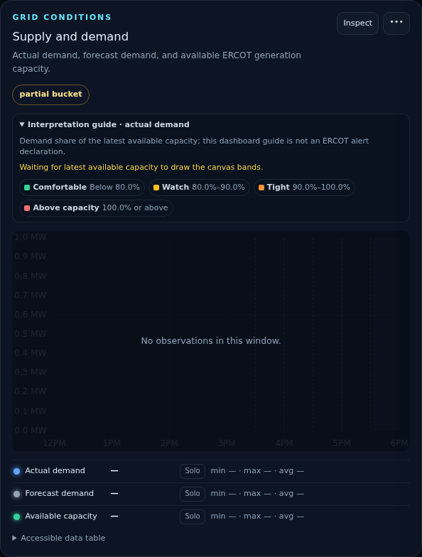
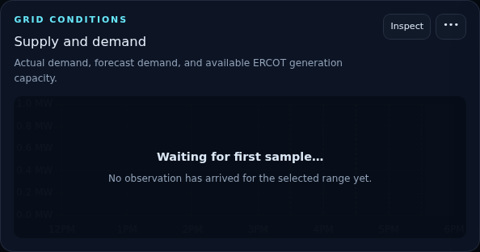
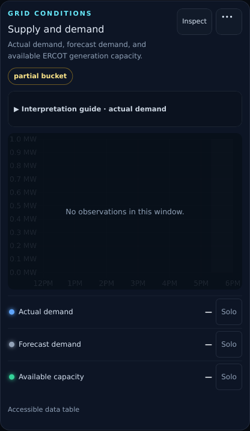
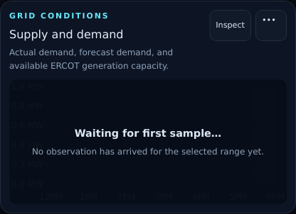

# PR 12: lifecycle-specific empty states

## Purpose

Replace ambiguous blank-chart and "No observations" treatments with explicit
data lifecycle states. A user can now tell whether the dashboard is still
loading, has not received a first sample, could not complete the latest request,
or has no operations events in the selected range.

## Screenshots

| Form factor | Before                                                       | After                                                      |
| ----------- | ------------------------------------------------------------ | ---------------------------------------------------------- |
| Desktop     |  |  |
| Mobile      |    |    |

## Lifecycle policy

| Condition                                  | User-facing state                           |
| ------------------------------------------ | ------------------------------------------- |
| Request in flight with no retained data    | `Loading…`                                  |
| Successful response without a first sample | `Waiting for first sample…`                 |
| Failed request without retained data       | `Temporarily unavailable…`                  |
| Failed refresh with retained observations  | Existing chart plus unavailable-update note |
| Empty operations query                     | `No events during selected range.`          |

The resolver treats retained observations as ready even while a refresh is in
flight or fails. Existing values therefore remain visible instead of being
covered by a loading state. Internal request errors remain in Diagnostics; the
public state contains only actionable language.

## Appropriate collapse

An empty chart keeps its title, description, source/menu access, and a concise
state panel. It removes the blank canvas, interpretation body, legend,
statistics, and empty accessible table; hides partial-bucket metadata that has
no observation; and disables CSV/table actions until data exists. Market
and source-health tables similarly collapse to a lifecycle panel rather than
showing headers with an empty body. Configured-off operations annotations remain
an explicit preference state rather than being mislabeled as missing data.

## Test coverage

- Unit tests cover all resolver branches, retained-data precedence, and exact
  lifecycle copy.
- Desktop Chromium verifies loading-to-waiting transition, request failure versus
  successful empty response, collapsed optional chart detail, empty market and
  diagnostics panels, and the selected-range operations message.
- Mobile Chromium and WebKit retain the failure/empty distinction and verify
  that collapsed empty cards do not introduce horizontal overflow.
- Dedicated desktop Chromium and 440 x 956 WebKit visual baselines cover the
  first-sample state; matching before/after documentation images are included.

## Accessibility impact

Lifecycle messages use text independent of color and expose a polite status
region. Blank canvases are not mounted, while populated canvases keep their
observation count and interpretation label. Disabled data
actions cannot lead keyboard or screen-reader users to an absent table or an
empty CSV. Existing dialog focus, view-navigation focus, target size, and
reduced-motion contracts are unchanged.

## Performance and migration notes

The policy adds no endpoint, request, timer, or persistent state. It avoids
creating Chart.js instances for empty cards, renders fewer chart-detail nodes,
and preserves the existing lazy-view request plan. APIs, storage, metric units,
scoring, alerts, collector behavior, and deployment configuration are unchanged.
Physical iPhone Safari review remains an external-device acceptance step.
