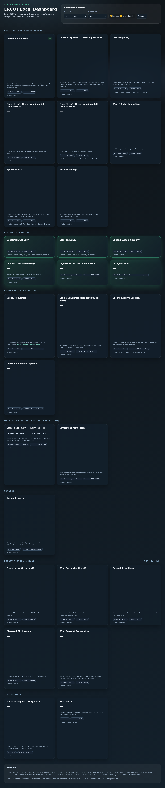
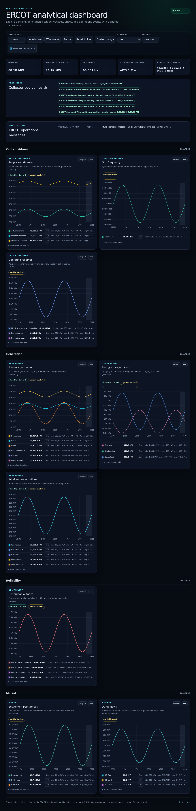

# Verification evidence

Date: 2026-07-21

## Environment

- Host shell Node: 25.2.1; pinned pnpm: 10.30.3. The standalone pnpm executable reports its
  embedded Node 20.11.1, so it prints an engine warning; the clean receiver image builds with Node 24.
- Python: 3.10.12 locally and 3.12 in the receiver image.
- Docker: 29.0.1; Compose: 2.40.3.
- Deno tests run in the collector image because Deno is not installed on the host.

## Deterministic and live source checks

- Collector: 8 fixture tests cover six success schemas, malformed JSON, zero-core data, repeated
  DST hour, stable unchanged hashes, stable event dedupe, and receiver-size chunking.
- One-shot live validation: fuel 2,896 points; storage 1,083; supply/demand 1,081; generation
  outages 18,020; operations messages 46 events; wind/solar 298 points.
- Receiver: 18 tests cover fresh/legacy migration, backup/restore, dedupe, event upsert, source
  health states, query/body/cache bounds, tag queries, SQL average/minmax bucketing, and seasonal
  transforms.
- Frontend: 7 unit tests cover live/fixed time, pause/navigation/zoom, URL restoration, comparison
  alignment, statistics, freshness, and unit formatting.

## Browser and visual checks

Playwright covers live/pause, one-window navigation, inspect/Escape, click-to-pin shared cursor,
legend hide/solo, preset and custom-offset comparison, chart-menu actions, events, CSV, URL state,
drag zoom, shift-pan, global zoom reset, explicit failed/empty/stale states, lazy mounting, long
tasks, heap growth, responsive collapse, and keyboard navigation.

The desktop fixture has nine configured charts and asserts that no more than four are initially
mounted. The browser budget rejects a largest observed long task of 500 ms or more and heap growth
of 64 MiB or more across lazy navigation and compare-mode churn. Shared-cursor publication is
coalesced into one animation frame and limited to currently visible subscribers.

Committed visual baselines cover normal supply/demand, price spike, negative price, storage
charging, stale storage source, an operations event, the full analytical dashboard, and the mobile
dashboard. The suite contains 11 browser tests.

## Before and after

Current production before this branch (read-only capture, 2026-07-21):

Deterministic feature dashboard after this branch:

## Query and growth benchmark

A synthetic 105,120-row/12-month tagged SQLite database was measured with the same script against
upstream `main` and this branch:

| Query                                      | Upstream median | Feature median | Result                                          |
| ------------------------------------------ | --------------: | -------------: | ----------------------------------------------- |
| Tagged 12-month raw, 105,120 points        |        0.1297 s |       0.1313 s | within run-to-run noise; no material regression |
| SQL hourly average, 8,760 points           |        0.0752 s |       0.0774 s | within run-to-run noise; no material regression |
| SQL two-hour min/max, 8,760 extrema points |             n/a |       0.2148 s | new spike-preserving path                       |

The dedupe retry inserted zero rows, reported one duplicate, and grew the database by zero pages.
The feature database was 86,016 bytes larger in this synthetic run due to additive schema/index
pages, not retry growth.

A repeated identical live batch request produced a cache hit. The mixed validation workload
finished with one hit and four cold misses (20% hit ratio); this is evidence that the cache path is
active, not a production hit-rate target.

The May 2026 production-copy reference (0.34-0.44 s tagged raw and about 0.04 s SQL hourly) used a
different database and environment, so it is retained as a rollout comparison target rather than
misrepresented as a directly comparable local number.

## Clean image and restart verification

Both images built with `docker compose build --no-cache`; the collector image reran all eight Deno
tests and the receiver image built the frontend under Node 24. Compose reached a healthy receiver,
and all six staggered sources completed through the authenticated receiver path. The large outage
payload was submitted in bounded batches and every receiver request returned HTTP 200.

Before restart there were 23,388 deduped metric rows with 23,388 unique keys and 46 events with 46
unique keys. After a receiver and collector restart, the database retained its rows and all sources
retried. Live feeds added 35 genuinely new deduped points; the final 23,423 deduped rows still had
23,423 unique keys, while the repeated 46-event payload remained 46 events. The receiver was
healthy, both containers logged normal operation, and the temporary containers/network were then
removed without deploying production.

## Current production proxy behavior

Read-only response-header checks on 2026-07-21 found Cloudflare in front of the live site. HTML and
API responses were `cf-cache-status: DYNAMIC`; `/api/status` preserved `Cache-Control: no-store`.
The current hashed JavaScript asset was Brotli encoded when requested with compression support and
returned `Cache-Control: max-age=14400`. This branch does not modify the external proxy.
